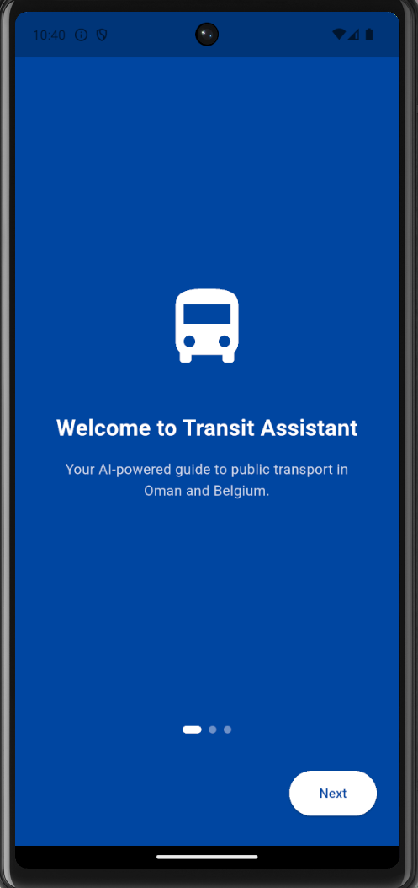
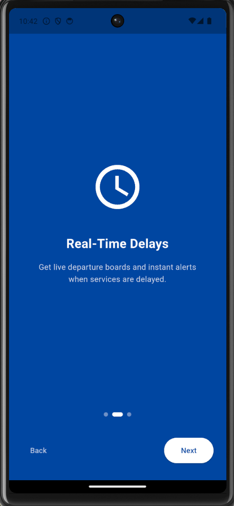
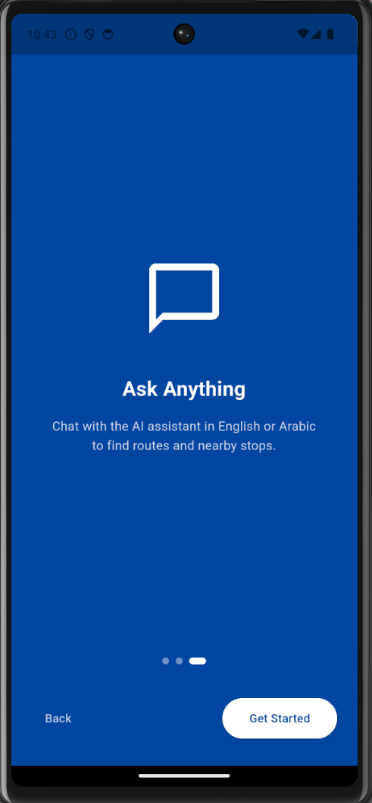
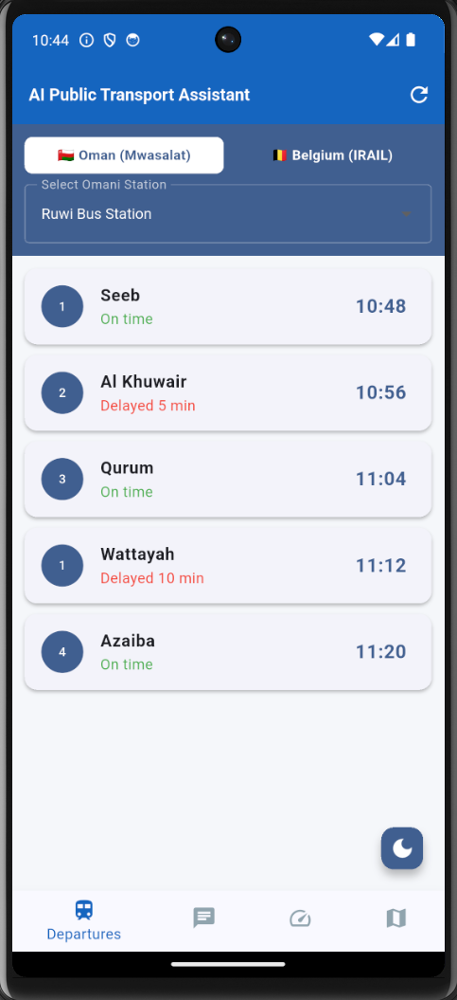
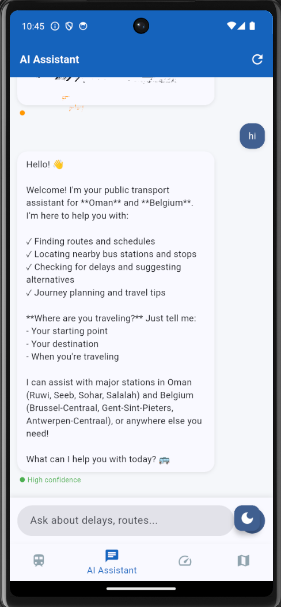
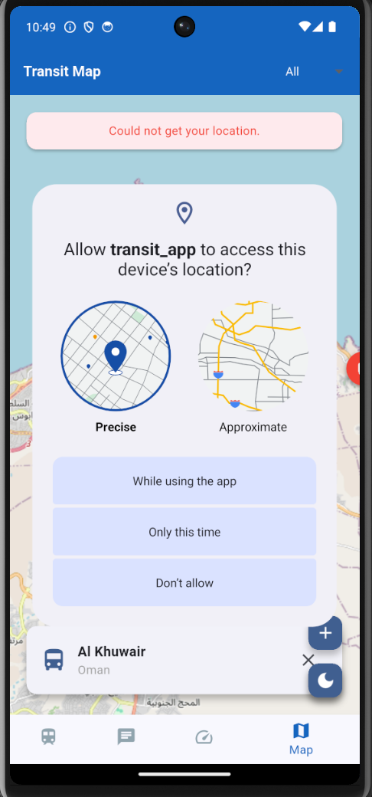
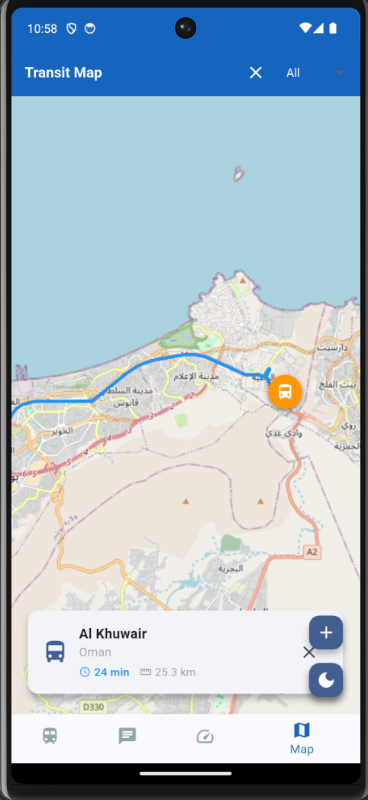

# AI Public Transport Assistant

A Flutter mobile application that provides real-time transit information and an AI-powered chat assistant for commuters in **Oman** and **Belgium**.

## Screenshots

 | | | |  |  |

## Features

- **Departure Board** — Live departure schedules for Oman (Mwasalat) and Belgium (iRail) stations
- **Delay Notifications** — In-app banner alerts when services are delayed
- **AI Chat Assistant** — Ask about delays, routes, and nearby stops in natural language
- **Multi-language** — Responds in English or Arabic depending on how you write
- **Transit Map** — Interactive map with station markers, route drawing, and estimated travel time + distance
- **Benchmark Screen** — Runs 50 test queries and measures AI response latency (mean, median, P95), exportable as CSV
- **Onboarding** — First-launch walkthrough shown once, skipped on subsequent opens

## Tech Stack

| Layer | Technology |
|-------|-----------|
| Framework | Flutter (Android / iOS) |
| AI | Anthropic Claude API (`claude-haiku-4-5`) |
| Belgium transit data | [iRail API](https://api.irail.be) |
| Oman transit data | Mock data (Mwasalat) |
| Map | flutter_map + OpenStreetMap tiles |
| Routing | OSRM (Open Source Routing Machine) |
| Local storage | sqflite (SQLite) |
| Preferences | shared_preferences |
| Location | geolocator |

## Project Structure

```
lib/
├── main.dart                    # App entry point, navigation, theme
├── models/
│   └── departure.dart           # Departure data model
├── screens/
│   ├── onboarding_screen.dart   # First-launch onboarding
│   ├── home_screen.dart         # Departure board
│   ├── chat_screen.dart         # AI chat interface
│   ├── benchmark_screen.dart    # Latency benchmark tool
│   └── map_screen.dart          # Interactive transit map
└── services/
    ├── claude_service.dart      # Anthropic Claude API client
    ├── transit_tools.dart       # AI tool functions (delays, routes, nearby)
    ├── transit_service.dart     # iRail API (Belgium)
    ├── mock_transit_service.dart# Mock data (Oman)
    └── cache_service.dart       # SQLite caching layer
```

## Getting Started

### Prerequisites

- Flutter SDK `^3.11.5`
- An [Anthropic API key](https://console.anthropic.com)
- Android emulator or physical device

### Installation

1. Clone the repository:
   ```bash
   git clone https://github.com/JuhainaAlbadi/transit_app.git
   cd transit_app
   ```

2. Install dependencies:
   ```bash
   flutter pub get
   ```

3. Create a `.env` file in the root directory:
   ```bash
   cp .env.example .env
   ```

4. Add your Anthropic API key to `.env`:
   ```
   ANTHROPIC_API_KEY=your_api_key_here
   ```

5. Run the app:
   ```bash
   flutter run
   ```

## Environment Variables

| Variable | Description |
|----------|-------------|
| `ANTHROPIC_API_KEY` | Your Anthropic API key from console.anthropic.com |

> Never commit your `.env` file. It is listed in `.gitignore` by default.

## Notes

- **Location on emulator** — The map's route feature requires a mock location. In the emulator, open Extended Controls (`...`) → Location → set coordinates and click Send.
- **SSL override** — `_DevHttpOverrides` in `main.dart` disables certificate validation for development. Remove this before deploying to production.
- **Oman data** — Mwasalat departures are simulated. Belgium departures use the live iRail API.
